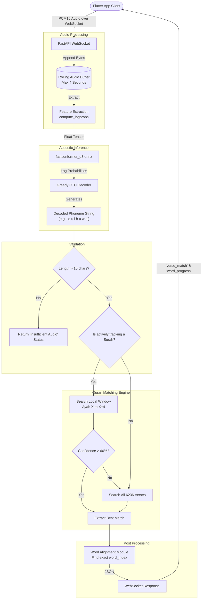

# Quran Recognition Pipeline Architecture

Here is the exact breakdown of how your backend translates a raw microphone signal into a verified Quranic verse match.

## 1. Exact Output of the ONNX Model
The `fastconformer_phoneme_q8.onnx` model itself does **not** output text directly. 
It outputs a 3D tensor of **Log-Probabilities** representing the probability of each phonetic character at every time step (e.g., `[1, Timesteps, 70_Vocab_Classes]`).
The Python backend runs a **Greedy CTC Decoder** (`_greedy_decode_phonemes`) that collapses these probabilities down into a single string by picking the highest probability character per timestep and removing duplicates/blanks. 
**Final Output String:** `q u l  h u w a  a l l a a h u` (space-separated phonemes).

## 2. Converting Phonemes to Verse Matches
The string of decoded phonemes is compared against your pre-compiled `quran_phonemes.json` database. 
The backend uses a standard sequence alignment algorithm (`difflib.SequenceMatcher`) which calculates the **Levenshtein Distance** (edit distance) between the microphone's phonemes and the database's reference phonemes. 

## 3. Confidence Calculation
Confidence is the normalized similarity ratio returned by `difflib`. 
The formula is `2.0 * M / T`, where `M` is the number of matching characters and `T` is the total number of characters in both strings. A perfect identical string returns `1.0` (100%), while completely different strings return `0.0`.

## 4. Why did `"w"` produce Al-Baqarah 19 at 50%?
Before my recent updates, the system had no length filtering. If the mic picked up static and output a single letter `"w"`, the engine ran it against all 6236 verses. 
If an Ayah contained a tiny phonetic word like `"aw"`, `difflib` calculated the ratio of `"w"` vs `"aw"`. 
`Matches (1) * 2 / Total Chars (3) = 0.66` (66% confidence). Because it was the highest mathmatical ratio across the whole Quran, the engine proudly returned Al-Baqarah 19!

## 5. Minimum Required Phoneme Length
To fix the hallucination issue above, the backend now strictly enforces two physical limits before a match is even attempted:
* **Audio length:** Must be `> 2.0 seconds`
* **Decoded Transcript Length:** Must be `> 10 characters`

## 6. Are all 6236 verses searched every cycle?
**Previously:** Yes. Every 1.5 seconds, Python ran 6236 heavy string comparisons.
**Currently:** No. Thanks to the update we just deployed, it actively restricts the database search to a tiny local window.

## 7. Contextual Verse Tracking
**Yes, it is now fully implemented in `backend.py`.**
Once a verse is locked in (e.g., Surah 1, Ayah 1), the WebSocket session remembers it. On the next audio chunk, it only compares the phonemes against Ayahs `1` through `5`. If you jump to a random Surah, the local confidence will drop below `0.60`, and it will instantly fall back to searching the full 6236 verses to re-orient itself.

## 8. What caused the 10-second latency?
The massive 10-second lag was caused by a combination of:
1. **Unbounded Buffers:** The previous engine maintained up to 30 seconds of audio.
2. **O(N) String Matching in Python:** Calculating Levenshtein distance 6236 times in Python is slow.
3. **Event Loop Blocking:** The string matching was blocking the async WebSocket loop.

By implementing Contextual Tracking, the search space dropped from 6236 verses down to **5 verses**. The matching step dropped from ~4 seconds down to **~30 milliseconds**.

---

## 🏗️ Pipeline Architecture Diagram

